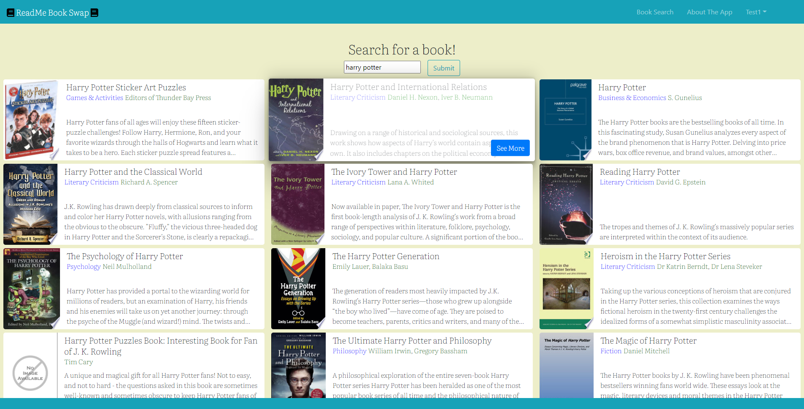
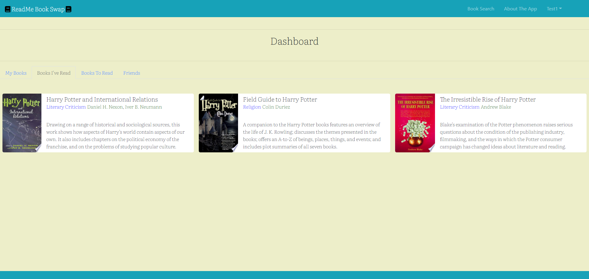

## ReadMe BookSwap


## URL <>


ReadMe Book Swap is an app for book lovers and new readers alike! RMBS provides a space for connecting with readers who want to trade books with others. Offer up a book you love and share it with friends! RMBS is the tiny library on the corner in your neighborhood if it was an app! Come search and find who has a book that you would like to borrow, barter, or lend.


**How To Use App**

- Account Login Name/Email:  test@me.com
- Password for Account: 1234

To use the app simply click on the link provided above. User can choose to register and login or can use the login and password that are provided directly above. Once logged in the user can search for certain books. To see the details of the book card just simply click the "See More" button on the card of the book and a modal dialog box will appear with the specific information regarding that book. If the user decides they want to add this to any of their lists, they can hit either "I own this book", "I have read this book", or "I want to read this book". Once the user has added to the appropriate group the user can then navigate to the corresponding page which is located within the "My Dashboard" dropdown menu. Here they can see each individual page that will correspond to any books that have been saved. When the user is finished, they can simply logout. 

**Tech Stack**

- React.js, Redux.js, Bootstrap, Sass, SQL, Sequelize, Passport
- API : Google Books API

**MVP**

Our base goal was to give the user the ability the register a username and password, login and choose a book from the search results so that they can add a chosen book to an "I own this book", "I have read this book", or "I want to read this book" list. 






**Stretch Goals**

Leaving reviews and comments on books.

**Code Snippets**

More Code:
```
   
```

Conditional Rendering for navbar if user is logged in or logged out:
```
let whichButtons;
    if (token !== “” && googleAuth === true) {
        whichButtons = <GoogleHeader />
    }
    else if (token !== “” && googleAuth === false) {
        whichButtons = <LocalHeader />
    }
    else {
        whichButtons = <LogInButton />
    }
    return (
        <>
            <Navbar collapseOnSelect expand=“lg” bg=“info” variant=“dark”>
            <Navbar.Brand as={Link} to=“/”><S.Font><FontAwesomeIcon className=“mr-1” icon={faBook} size=“1x” color=“black” />ReadMe Book Swap<FontAwesomeIcon className=“ml-1" icon={faBook} size=“1x” color=“black” flip={“horizontal”} /></S.Font></Navbar.Brand>
                <Navbar.Toggle aria-controls=“responsive-navbar-nav” />
                <Navbar.Collapse id=“responsive-navbar-nav”>
                    <Nav className=“ml-auto mr-5">
                    {whichButtons}
                    </Nav>
                </Navbar.Collapse>
            </Navbar>
        </>
    )

```

Mode Code:
```


```


<!-- **Screen Shots and GIFS**

Search Capabilities
   -->
  
<!-- Saving Cards to Personal Lists
 -->


**Developer Team**

- Joe Stocks: 
- Jacob Deel: UX, Design, Responsiveness
- Claude Major: 
- Ian Haddock: UX, Design, Responsiveness
