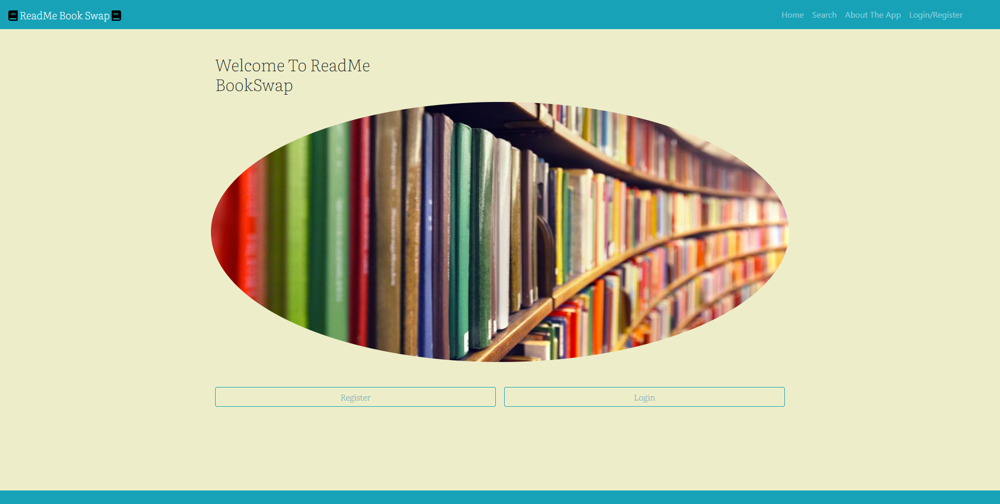

## ReadMe BookSwap


## URL <>


ReadMe Book Swap is an app for book lovers and new readers alike! RMBS provides a space for connecting with readers who want to trade books with others. Offer up a book you love and share it with friends! RMBS is the tiny library on the corner in your neighborhood if it was an app! Come search and find who has a book that you would like to borrow, barter, or lend.





### How To Use App

- Account Login Name/Email:  test@me.com
- Password for Account: 1234

To use the app simply click on the link provided above. User can choose to register and login or can use the login and password that are provided directly above. Once logged in the user can search for certain books. To see the details of the book card just simply click the "See More" button on the card of the book and a modal dialog box will appear with the specific information regarding that book. If the user decides they want to add this to any of their lists, they can hit either "I own this book", "I have read this book", or "I want to read this book". Once the user has added to the appropriate group the user can then navigate to the corresponding page which is located within the "My Dashboard" dropdown menu. Here they can see each individual page that will correspond to any books that have been saved. When the user is finished, they can simply logout. 

### Tech Stack

- React.js, Redux.js, Bootstrap, Sass, SQL, Sequelize, Passport
- API : Google Books API

### MVP

Our base goal was to give the user the ability the register a username and password, login and choose a book from the search results so that they can add a chosen book to an "I own this book", "I have read this book", or "I want to read this book" list. We also allowed for users to become "friends" and view each other's owned books and give access to "friends" email.


### Stretch Goals

Leaving reviews and comments on books. Chatting with friends.

### Code Snippets

**Server side logic to create entry in Personal Tables (OwnedBooks, ReadBooks, WantToReadBooks).**
**Creates a mapping object that is indexed by "owned", "read", or "want" to create the entry in the correct table.:**
```
const findOrCreatePersonalListEntry = async (dbTableModel, userID, bookID) => {
  return await dbTableModel.findOrCreate({
    where: {
      userID: userID,
      bookID: bookID,
    },
  });
};
const findOrCreatePersonalListFunctionMapping = {
  owned: async (userID, bookID) =>
    await findOrCreatePersonalListEntry(db.OwnedBooks, userID, bookID),
  read: async (userID, bookID) =>
    await findOrCreatePersonalListEntry(db.ReadBooks, userID, bookID),
  want: async (userID, bookID) =>
    await findOrCreatePersonalListEntry(db.WantToReadBooks, userID, bookID),
};
```
**Client Side of Creating Book Entry in Personal Tables**
```
export const addBookToPersonalLists = async (book, whichList) => {
  try {
    let response = await axiosInstance.post("http://localhost:3005/books", {
      book,
      whichList,
    });
    if (response.data[1]) {
      toast.success(
        `${book.title} was added to your ${capitalize(whichList)} List`
      );
    } else {
      toast.warn(
        `${book.title} is already in your ${capitalize(whichList)} List`
      );
    }
  } catch (err) {
    console.error(err);
    toast.error("There was an ERROR saving your book!");
  }
};
```

**Conditional Rendering for navbar if user is logged in or logged out:**
```
let whichButtons;
    if (token !== “” && googleAuth === true) {
        whichButtons = <GoogleHeader />
    }
    else if (token !== “” && googleAuth === false) {
        whichButtons = <LocalHeader />
    }
    else {
        whichButtons = <LogInButton />
    }
    return (
        <>
            <Navbar collapseOnSelect expand=“lg” bg=“info” variant=“dark”>
            <Navbar.Brand as={Link} to=“/”><S.Font><FontAwesomeIcon className=“mr-1” icon={faBook} size=“1x” color=“black” />ReadMe Book Swap<FontAwesomeIcon className=“ml-1" icon={faBook} size=“1x” color=“black” flip={“horizontal”} /></S.Font></Navbar.Brand>
                <Navbar.Toggle aria-controls=“responsive-navbar-nav” />
                <Navbar.Collapse id=“responsive-navbar-nav”>
                    <Nav className=“ml-auto mr-5">
                    {whichButtons}
                    </Nav>
                </Navbar.Collapse>
            </Navbar>
        </>
    )

```

**Custom server side authentication callback to inform the user of any signup issues.:**
```
router.post("/signin", (req, res, next) => {
    passport.authenticate('local', { session: false }, (err, user, info) => {
        if (err) {
            return res.status(405).json({ message: "User not found!" })
        }
        if (!user) {
            return res.status(410).json({ message: info.message })
        }
        req.logIn(user, { session: false }, (err) => {
            if (err) {
                return res.status(410).json({ token: "", message: "Something went wrong!" })
            }
            //validate user in middleware
            // create token and save to db
            let jwtToken = createToken(user);
            // send token to user
            return res.json({ token: jwtToken, firstName: req.user.firstName, lastName: req.user.lastName });
        });
    })(req, res, next);
});

```

**Custom functional component to protect routes on the client side:**
```
const ProtectedRoute = ({ component: PrRoute, ...rest }) => {
    const token = useSelector(state => state.token);
    return (
        < Route {...rest} render={(props) => {
            console.log('in protected');
            if (token) {
                return <PrRoute  {...props} />
            }
            else {
                return <Redirect
                    to={{
                        pathname: '/login',
                        state: { from: props.location }
                    }} />
            }
        }}
        />
    )
};

```
**Custom functional component to protect routes on the client side:**
```
const ProtectedRoute = ({ component: PrRoute, ...rest }) => {
    const token = useSelector(state => state.token);
    return (
        < Route {...rest} render={(props) => {
            console.log('in protected');
            if (token) {
                return <PrRoute  {...props} />
            }
            else {
                return <Redirect
                    to={{
                        pathname: '/login',
                        state: { from: props.location }
                    }} />
            }
        }}
        />
    )
};

```
**Axios interceptor adds token to every internal api http request using this axios instance. The fetch function is a simplified example of how to use the intercepted axios instance.:**
```
const axiosInstance = axios.create();
axiosInstance.interceptors.request.use(function (config) {
  config.headers.Authorization = loadTokenFromLocalStorage();
  return config;
});
export const fetchUserSearchResults = async (searchQuery) => {
  try {
    return await axiosInstance.post("http://localhost:3005/users", {
      searchQuery,
    });
  } catch (err) {
    console.error(err);
  }
};

```


### Screenshots and GIFs<br/><br/>
**Logging in with Google**


**Logging in with email and password on mobile device**<br/>


**Adding Books to Personal Lists**


**Searching for Books**


**Sending and Accepting Friend Request**


**Searching for New Friends/Viewing Friends' Books**


  


### Developer Team

- Joe Stocks: Database, API, Search Logic
- Claude Major: Authentication, Security, Database
- Ian Haddock: UX, Design, Responsiveness
- Jacob Deel: UX, Design, Responsiveness
